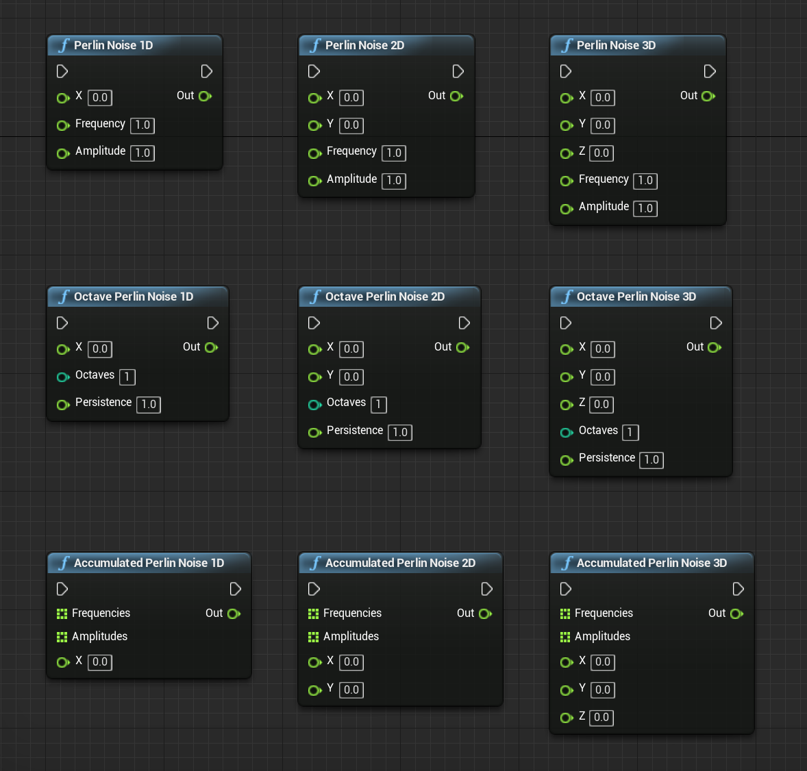
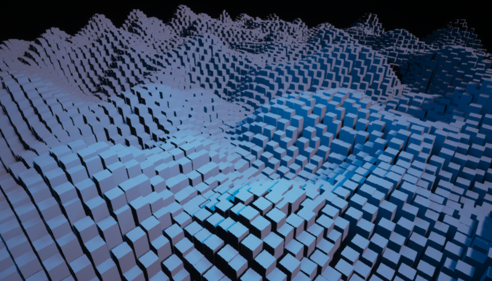

# UE4 Plugin: Noise Blueprint Library

This UE4 plugin provides utility Blueprint Functions to generate noises.

## Supported Environment

This plugin is tested on the below environment.

* UE4 Version: 4.22
* OS: Windows/Mac

## Installation

#### 1. Download source codes

Download whole project's source codes from [GitHub](https://github.com/nutti/UE4-Noise-BlueprintLibrary/archive/master.zip) and unzip them.

#### 2. Copy the plugin source codes

Copy the plugin source codes (`NoiseBlueprintLibrary` directory) into the plugin directory (`Plugin` directory) on your UE4 project.

#### 3. Generate a project file for each IDE

Generate a project file for Visual Studio (Windows) or XCode (Mac).

#### 4. Build

Build whole source codes including plugin source codes.

#### 5. Launch UE4 editor and enable plugin

Launch .uproject file and enable plugin via *Settings* > *Plugins* > *Project* > *Blueprints* > *Noise Blueprint Library*

.
## Features / Tutorials

### Perlin Noise

* `Perlin Nose 1D/2D/3D` generates perlin noise
   * Input
      * X, Y, Z: Position
      * Frequency: Frequency
      * Amplitude: Scale factor of generated noise
   * Output
      * Out: Generated Noise [0.0, 1.0 * Amplitude]
* `Octave Perlin Noise 1D/2D/3D` generates perlin noise accumulated from different octaves
   * Each octave generates a noise whose frequency is *2^(octave-1)* and amplitude is *persistence^(octave-1)*
   * Input
      * X, Y, Z: Position
      * Octave: Number of octaves
      * Persistence: Base of amplitude
   * Output
      * Out: Generated Noise [0.0, 1.0 * Amplitude * Octave]
* `Accumulated Perlin Noise 1D/2D/3D` generates perlin noise accumulated from different frequencies and amplitudes
   * Input
      * Frequencies: Frequencies
      * Amplitudes: Scale factors of generated noise
      * X, Y, Z: Position
   * Output
      * Out: Generated Noise [0.0, 1.0 * Sum(Amplitudes)]

#### Application of Perlin Noise

* Generate Terrain

